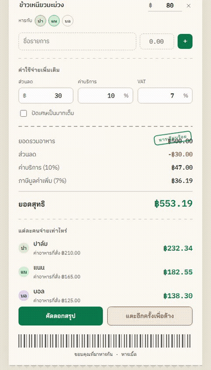

# Han Bell (หารเบิ้ล)

A receipt-styled bill-splitting web app. Add the food items and the friends splitting the bill, and see exactly how much each person owes — instantly.

**Live demo: [han-bell.vercel.app](https://han-bell.vercel.app)**

## Demo



## Features

- Add/remove people splitting the bill, each with a unique colored avatar
- Add food items one by one, and choose exactly who shares each item (no need to split everything evenly)
- Apply a discount, a service charge (%), and VAT (%)
- Optionally round totals to whole baht
- Automatically calculates each person's final share, distributing discount/service/VAT proportionally to what they actually ordered
- "Copy summary" button to paste the breakdown straight into a group chat
- Bill data is saved to the browser's `localStorage`, so it's still there next time you open the page

## How to Use

1. **Name the bill** — click the title at the top of the receipt and type a name (e.g. the restaurant name).
2. **Add people** — under "Who's splitting the bill", type a name into the "+ Add friend" field and press Enter for each person. Click the ✕ on a chip to remove someone.
3. **Add food items** — under "Food items", enter the item name and price, then submit to add it to the list.
4. **Choose who shares each item** — every item shows a "Split with" row of avatars. Click an avatar to toggle whether that person is included in that item; items start shared by everyone currently on the bill.
5. **Add extra charges** — under "Additional charges", set a discount amount (฿), a service charge (%), and VAT (%). Check "Round to whole baht" if you want cleaner numbers.
6. **Check the totals** — the receipt shows the subtotal, discount, service charge, VAT, and grand total, followed by exactly how much each person pays.
7. **Share the result** — click "Copy summary" to copy a ready-to-paste breakdown, or "Clear all" (tap twice to confirm) to start a new bill.

Your entries are saved automatically in your browser, so you can safely close the tab and come back later without losing the bill.

## Getting Started

Install dependencies (once):

```bash
npm install
```

Run the development server:

```bash
npm run dev
```

Open [http://localhost:3000](http://localhost:3000) in your browser.

## Build for Production

```bash
npm run build
npm run start
```

## Deployment

This repo deploys automatically via GitHub Actions:

- [`.github/workflows/ci.yml`](.github/workflows/ci.yml) — runs lint and build on every push/PR
- [`.github/workflows/deploy.yml`](.github/workflows/deploy.yml) — deploys to [Vercel](https://vercel.com) on every push to `main`, using the Vercel CLI (requires the `VERCEL_TOKEN`, `VERCEL_ORG_ID`, and `VERCEL_PROJECT_ID` repository secrets)

## Tech Stack

- [Next.js](https://nextjs.org) (App Router, TypeScript, Turbopack)
- Plain React state — no backend or database; all data stays in the user's browser
- Chakra Petch, IBM Plex Sans Thai, and IBM Plex Mono fonts loaded via [`next/font/google`](https://nextjs.org/docs/app/building-your-application/optimizing/fonts) (self-hosted at build time, no runtime CDN dependency)

## Project Structure

- `src/app/page.tsx` — the page and all the bill-splitting calculation logic
- `src/app/page.module.css` — styles for the receipt UI
- `src/app/globals.css` — color tokens (light/dark) and base resets
- `src/app/layout.tsx` — root layout, fonts, metadata
